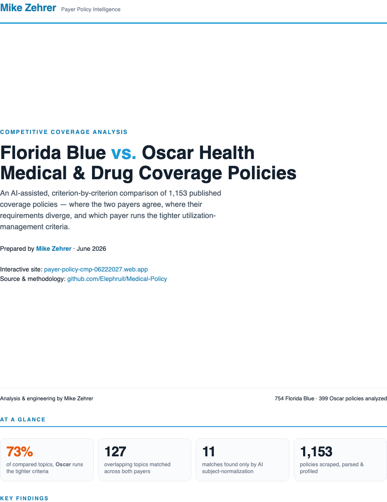
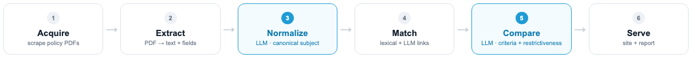

<div align="center">

<h1>Payer Coverage Policy Intelligence</h1>

<p><b>Scrape, normalize, and LLM-compare U.S. health-insurer coverage policies — then ship it as an interactive site and a branded findings report.</b></p>

<p><i>Designed, built &amp; analyzed by <b>Mike Zehrer</b></i></p>

<p>
<a href="https://payer-policy-cmp-06222027.web.app"></a>
<a href="report/Coverage-Comparison-FloridaBlue-vs-Oscar.pdf"></a>
</p>

<p>


</p>

</div>

> **What this answers:** for the same drug or service, how do two insurers' coverage criteria
> differ — and **which payer runs tighter utilization-management criteria** (a proxy for cost
> savings, weighed against member/provider abrasion)? On the current data, **Oscar runs the tighter
> criteria on ~73% of overlapping topics.**

<p align="center">
  <a href="report/Coverage-Comparison-FloridaBlue-vs-Oscar.pdf">
    
  </a>
</p>

**Sources:** Blue Cross Blue Shield of Florida (`mcgs.bcbsfl.com`) · Oscar Health
(`hioscar.com/clinical-guidelines`, medical + pharmacy) — **~1,150 policies**. The design is
source-agnostic: each new payer is one new *adapter*; extraction, schema, matching, the LLM
comparison, the website, and the report are shared.

---

## How it works (end-to-end flow)

<p align="center"></p>

Each stage is a separate, re-runnable command. The two **LLM** stages (normalize, compare) are
cached on disk by content hash, so re-running is incremental and free unless inputs change. Behind
the scenes the bundle is assembled by `pull` → `extract` → `export_web` (with `llm_normalize`'s
same-subject links force-merged into matching) and `analyze --llm` (aligned criteria +
restrictiveness verdict per topic).

### 1. Acquire — `scripts/pull.py` → `policydb/pipeline.py`
Each payer has a `SourceAdapter` (`policydb/sources/`) that yields a catalog of
documents and fetches each as a PDF. BCBS-FL is a stateful ASP.NET/Telerik site
(sequential; see *How BCBS-FL works* below); Oscar is a Next.js/Contentful site
whose PDFs live on a CDN (stateless, fetched in parallel). Results land in
SQLite (`policydb/db.py`), with `content_hash` for change detection on re-pulls.

### 2. Extract — `policydb/extract.py`
PDF bytes → full text + structured fields (payer policy number, authoritative
subject/title, effective & revision dates, CPT/HCPCS codes, page count). Pure
function over bytes, source-agnostic.

### 3. Normalize every policy (LLM, Phase 1) — `scripts/llm_normalize.py`
One **Claude Haiku** call per policy distills it into a compact profile:
`canonical_subject` (generic drug INN or standard service name), brand names,
type, drug class, and the key medical-necessity requirements. Output is forced
through a tool schema for valid structured JSON and cached per policy.

This is the "pass every policy through the LLM" step. Its purpose is **matching
recall**: the canonical subject is a payer-agnostic identity key, so the same
drug can be linked across insurers even when their document *titles* differ
(e.g. *"Ponvory (ponesimod) Tablet"* vs *"Ponesimod … (PG230)"*). It writes:
- `data/llm_profiles.json` — `id → profile`
- `data/llm_links.json` — conservative cross-payer same-subject link pairs

Conservative linking (`policydb/llm_normalize.py: derive_links`): a drug links
only on an exact generic **or** brand-name match; a service only on an exact
canonical-subject match; class guidelines are left to the dedicated drug-family
logic to avoid over-merging.

### 4. Match into cross-payer topics — `policydb/match.py` via `scripts/export_web.py`
Two signals, unioned with a union-find:
1. **Lexical** — IDF-weighted cosine over normalized title tokens (with a light
   stemmer and a rare-drug-name rescue), blocked by shared token to stay
   sub-quadratic. Deterministic across runs (sorted reductions, fixed FP order).
2. **LLM force-links** — the `data/llm_links.json` pairs from Phase 1, injected
   as `extra_links`, merge same-subject policies the title matcher missed.

A topic is flagged `llm_matched` **only when it is cross-payer solely because of
the LLM links** — computed by a baseline diff against the pure lexical matcher,
so the "AI-matched" badge reflects genuinely new matches, not ones merely
re-confirmed. `export_web.py` writes the website bundle: `index.json`,
`topics.json`, `meta.json`, per-policy `text/<id>.json`, and `drug_families.json`
(Oscar drug-class guidelines mapped to BCBS per-drug policies, content-based —
`policydb/drug_families.py`).

### 5. Compare + score restrictiveness (LLM, Phase 3) — `scripts/analyze.py --llm`
For each cross-payer topic, one **Claude Sonnet** call reads both payers'
coverage-criteria text (following BCBS-FL's consolidation to its parent class
guideline) and returns, via a forced tool schema:
- a one-line plain-English **summary** of the key difference,
- **shared** requirements, each marked `same` / `differs`,
- requirements **unique to each payer**,
- a **restrictiveness verdict** — which payer is harder to get approved under,
  its magnitude, the rationale, and a cost-vs-abrasion note.

`analyze.py` aggregates the verdicts into a "who runs tighter criteria" rollup
and also emits the coverage-gap lists (topics only one payer publishes) and the
hand-curated key findings (`data/analysis_findings.json`), re-pointing each
finding's example links to current topic ids by drug token (ids renumber
whenever matching changes). Output: `web/public/data/analysis.json`.

> A regex-based fallback comparison (`SIGNALS` in `analyze.py`, and a client-side
> criteria parser in `web/src/criteria.ts`) renders when the LLM layer hasn't
> been run, so the site is fully functional without an API key.

### 6. Serve — `web/` (React + Vite → Firebase Hosting)
The site reads the static JSON bundle — **no database, no server, no billing**.
See [`web/README.md`](web/README.md).

---

## Methodology notes

- **Why an LLM layer at all?** Coverage criteria are dense, inconsistently
  formatted clinical prose extracted from PDFs. Token/regex matching mislabels
  paraphrases (e.g. *"12 months of age or older"* vs *"at least 12 months"*) and
  can't reliably pull the right *section* out of a messy document. The LLM does
  the semantic normalization, alignment, and restrictiveness judgment that rules
  can't.
- **Two model tiers for cost.** Haiku for the ~1,150 per-policy normalizations
  (cheap, high-volume); Sonnet for the ~130 nuanced per-topic comparisons. Both
  cached, so the whole enrichment is a bounded one-time cost.
- **Structured output via forced tool-use** (`tool_choice` pinned to a single
  tool) guarantees schema-valid JSON without relying on newer
  structured-output APIs.
- **Restrictiveness ≠ verdict on quality.** Tighter criteria likely lower
  utilization and cost for that payer, *but* can drive member/provider abrasion;
  the UI states this trade-off explicitly. In the current snapshot Oscar reads as
  the more restrictive payer on the large majority of shared topics.
- **Determinism & idempotence.** The lexical matcher is byte-stable run-to-run;
  every LLM result is cached by a hash of (prompt version, model, inputs), so
  pipelines are reproducible and re-runs only touch changed inputs.

---

## Layout

```
policydb/
  sources/base.py      SourceAdapter interface (catalog + fetch_document)
  sources/bcbsfl.py    BCBS-FL adapter (stateful Telerik postbacks; see below)
  sources/oscar.py     Oscar adapter (Next.js/Contentful; stateless, parallel)
  extract.py           PDF -> text + parsed fields (policy#, subject, dates, CPT/HCPCS)
  match.py             cross-payer clustering: IDF-cosine titles + LLM force-links
  drug_families.py     Oscar drug-class guideline ↔ BCBS per-drug mapping (content-based)
  llm_normalize.py     Phase 1: per-policy LLM profile + conservative link derivation
  llm_compare.py       Phase 3: per-topic LLM criteria comparison + restrictiveness
  env.py               minimal .env loader (so keys needn't be exported in the shell)
  db.py                SQLite schema + FTS5 full-text index (self-migrating)
  pipeline.py          orchestration: catalog -> fetch -> extract -> store
scripts/
  pull.py              CLI: pull a source into the dataset
  query.py             CLI: stats / search / show / compare
  llm_normalize.py     run Phase 1 over every policy -> profiles + links
  export_web.py        build the website bundle (accepts --llm-links)
  analyze.py           build analysis.json (--llm for the criteria comparison)
web/                   React + Vite comparison + analysis site (Firebase Hosting)
data/                  SQLite dataset + LLM artifacts (all git-ignored)
```

---

## Usage

### Build the dataset
```bash
pip install requests pypdf anthropic            # deps

# Pull each payer (BCBS-FL is stateful/sequential; allow ~20-40 min)
python scripts/pull.py bcbsfl --db data/policies.db
python scripts/pull.py oscar  --db data/policies.db
python scripts/pull.py bcbsfl --db data/policies.db --limit 20   # quick test
```

### Query from the CLI
```bash
python scripts/query.py --db data/policies.db stats
python scripts/query.py --db data/policies.db search "continuous glucose monitor"
python scripts/query.py --db data/policies.db show 09-E0000-14
python scripts/query.py --db data/policies.db compare "cgm" "glucose monitor"
```

### Run the LLM enrichment + build the website bundle
The scripts read `ANTHROPIC_API_KEY` from a git-ignored `.env` (or the
environment):
```bash
echo 'ANTHROPIC_API_KEY=sk-ant-...' > .env

python -m scripts.llm_normalize --limit 20                  # smoke test
python -m scripts.llm_normalize                             # ~1,150 Haiku calls (cached)
python -m scripts.export_web --llm-links data/llm_links.json
python -m scripts.analyze --llm                             # Sonnet comparison + restrictiveness

cd web && npm install && npm run build                      # then `firebase deploy`
```
Every script takes `--model` to override the model; LLM results cache under
`data/llm_cache/`, so re-runs and interruptions are cheap. Without `--llm` /
`--llm-links` the pipeline still produces a working site using the regex
fallback comparison.

---

## Schema

`policies` — one row per document (`source`, `doc_key`):
`policy_id` (payer MCG#), `title` (site nav), `subject` (authoritative title from
the PDF), `effective_date`, `revised_date`, `page_count`, `cpt_codes` (JSON),
`full_text`, `content_hash` (change detection on re-pulls), `source_url`.
`placements` holds each category a document is filed under. Full-text search uses
the `policies_fts` FTS5 table. It's a plain SQLite file — query it with any SQL
tool, BI client, or pandas.

---

## How BCBS-FL works (for maintainers)

The site is ASP.NET WebForms + Telerik RadPanelBar. Two non-obvious facts drive
the adapter:

1. **The catalog is fully in the landing page.** Titles live in `<span class="rpText">`
   and internal file paths in a Telerik `itemData` JSON tree of identical shape.
   Each document has a *hierarchical index* (e.g. `1:1:230`).

2. **PDFs are not directly addressable.** `/mcg?FilePath=<x>` returns whatever the
   server *session* currently has selected — `<x>` is ignored. To select a
   document you must replay the RadPanelBar click postback (`__EVENTTARGET`,
   `__EVENTARGUMENT=<index>`, and `RadPanelBar1_ClientState` with the selected +
   expanded items), carrying ViewState forward. The response embeds a fresh
   numeric handle; fetching `/mcg?FilePath=<handle>` in the same session returns
   the PDF.

   Gotchas the adapter handles: the *first* postback after loading doesn't take
   (we prime once), and re-clicking the already-selected item is a no-op (we
   crawl distinct items in order, and prime on the last leaf so it differs from
   the first). Because the session is stateful, fetching is **sequential**.

Titles/categories from the nav are treated as hints — the authoritative title,
MCG number, and dates are parsed from the PDF content itself.

---

## Adding a competitor

Implement a `SourceAdapter` (`catalog()` yielding `CatalogEntry` rows, and
`fetch_document()`), register it in `policydb/__init__.py`, and run `pull.py`.
Stateless sites can set `sequential = False` to fetch in parallel. The matching,
LLM enrichment, and website are payer-agnostic and pick up the new source
automatically.
